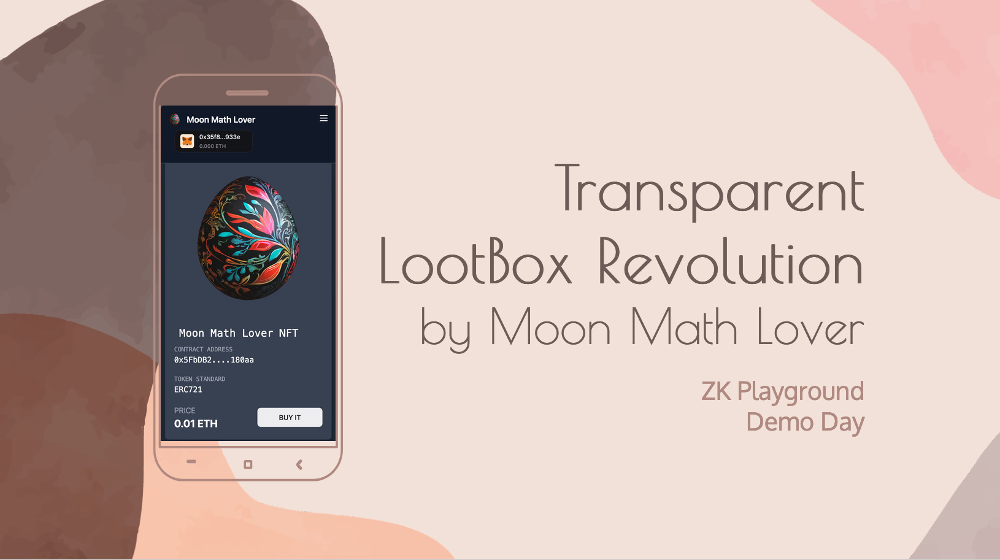

# Transparent LootBox Revolution

**Unbiased Entropy + Verified Fisher-Yates Shuffle → Credibly Fair Lootbox Reveals**

- Team: [Moon Math Lover](https://www.zkpvoting.tw/#/projects/5)
- [Slides](https://docs.google.com/presentation/d/1F-7g9LK5LqNuUBk4tWYUMNoARV6irYQn3CXZfSE7ayQ/edit#slide=id.ga25f85cae5_0_0), [Video](https://www.youtube.com/watch?v=gX_u7Phva5A&feature=youtu.be)
- ZK Circuits: [MoonMathLover/fisher-yates](https://github.com/MoonMathLover/fisher-yates)
- Smart contracts: [MoonMathLover/demo-contract](https://github.com/MoonMathLover/demo-contract)
- Frontend: [MoonMathLover/final_project](https://github.com/MoonMathLover/final_project)
- [Instructions for running the code](https://github.com/MoonMathLover/final_project/blob/main/README.md)
